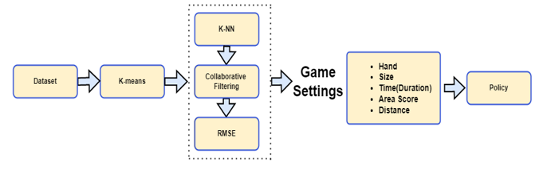
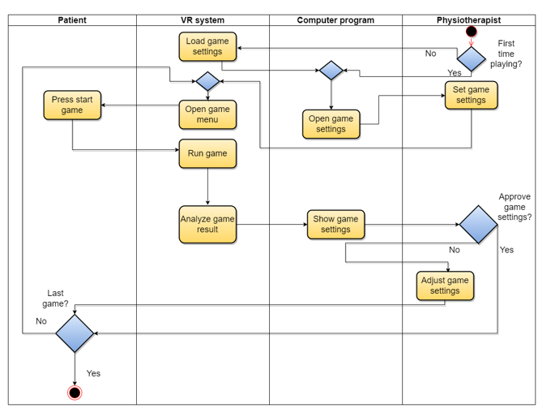

# VR_PROJECT_

## Instructions: 
### How to Add new Files:
```
git add [Folder_Name]/[File_name] 
(If want to update all the files in folder: git add [Folder_Name]/**)
git commit -m "[Description of the changes.]"
git push
```
### How to Get the latest Version:
```
git pull
```

## `The Project Flow Chart:`


## `The Project Activity Diagram:`

.
..